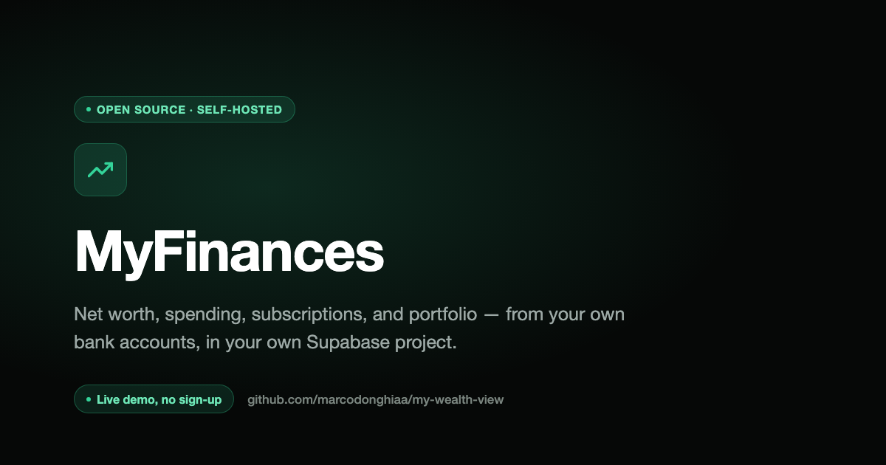

# My Wealth View

An open-source, self-hosted net worth dashboard: bank accounts, investment portfolio, and crypto holdings in one place, converted to a single reporting currency.

**Try it live, no login:** [myfinancesss.lovable.app/demo](https://myfinancesss.lovable.app/demo)



This is the frontend half of a two-repo project. The data pipeline that feeds it (open banking sync, FX rates, AI categorization, portfolio/crypto pricing, self-hosting setup) lives in the backend repo, [finance-app](https://github.com/marcodonghiaa/myfinances) — start there to self-host.

If this is useful to you, a ⭐ on both repos helps other people find them.

## Screens

- **Net Worth** — total net worth over time (bank + portfolio + crypto), with an EUR/USD/GBP toggle.
- **Transactions** — full transaction register with inline category editing.
- **Subscriptions** — recurring charges with auto-detected billing frequency and true monthly-equivalent cost.
- **Spending** — spend by category, month over month.
- **Income vs Expenses** — monthly income/expense comparison.
- **Portfolio** — stock/ETF holdings, allocation breakdown, and live-priced value.
- **Crypto** — crypto holdings (Coinbase-synced and manually tracked), allocation breakdown, and live-priced value.
- **Rules** — user-editable rules that steer automatic transaction categorization ahead of the AI fallback.

## How it's built

- [TanStack Start](https://tanstack.com/start) (React) + Tailwind + shadcn/ui, built and maintained via [Lovable](https://lovable.dev), two-way git-synced with this repo.
- Data access goes exclusively through an authenticated Supabase client using the publishable (anon) key — every read/write is subject to Row Level Security on the underlying tables. There is no service-role key anywhere in this app.
- Connects to your own Supabase project (set via `.env`) rather than a Lovable-provisioned database — this app and the backend sync pipeline are two consumers of the same Postgres instance. Without a `.env`, it falls back to a read-only reference project (with a console warning) so the build never breaks — set your own credentials to see your own data.

## Development

Requires [Bun](https://bun.sh) (`curl -fsSL https://bun.sh/install | bash`), and a Supabase project with this project's schema already applied — that's what the backend repo's [setup wizard](https://github.com/marcodonghiaa/myfinances#setup) does; run that first if you haven't.

```sh
git clone https://github.com/marcodonghiaa/my-wealth-view.git
cd my-wealth-view
bun install
cp .env.example .env   # fill in your Supabase project's URL + publishable key
bun run dev
```

The maintainer's own instance is additionally two-way synced with a private [Lovable](https://lovable.dev) project — that link is maintainer-only and not needed to build, run, or contribute to this repo.

## Security notes

- No service-role key ever touches this codebase or runs in a browser context. A `client.server.ts` scaffold for one occasionally gets auto-regenerated by Lovable's platform tooling — if you see it reappear, delete it; it's dead code with no working credential behind it.
- All data access is RLS-scoped to the logged-in user (`auth.uid() = user_id`) at the database layer, not just filtered client-side.

## License

[MIT](LICENSE)
