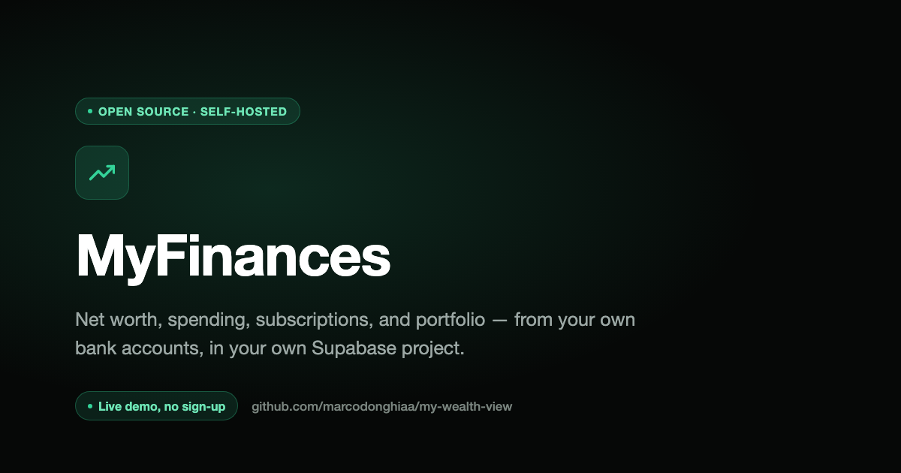

# My Wealth View

A self-hosted net worth dashboard. Bank accounts, investments and crypto in one place, converted to a single currency.



- **Net Worth**: total over time (bank + portfolio + crypto), in EUR, USD or GBP
- **Transactions**: full register with inline categories and a "worth it?" check
- **Subscriptions**: recurring charges with detected billing frequency and true monthly cost
- **Spending** and **Income vs Expenses**: monthly breakdowns
- **Portfolio** and **Crypto**: holdings, allocation and live-priced value

This is the frontend. The data pipeline (bank sync, FX rates, AI categorization, pricing, setup wizard) is in [myfinances](https://github.com/marcodonghiaa/myfinances). Start there to self-host.

## Stack

TanStack Start (React), Tailwind, shadcn/ui, Supabase. The app only uses the publishable key, so every read and write goes through Row Level Security (`auth.uid() = user_id`). No service-role key is used anywhere.

## Run it

Needs [Bun](https://bun.sh) and a Supabase project with the schema applied (the backend's `setup.sh` does this).

```sh
git clone https://github.com/marcodonghiaa/my-wealth-view.git
cd my-wealth-view
bun install
cp .env.example .env   # your Supabase URL + publishable key
bun run dev
```

Without a `.env`, the app falls back to the maintainer's Supabase project, so set your own.

## Scripts

`bun run dev` · `bun run build` · `bun run test` · `bun run lint` · `bun run format`

## License

[MIT](LICENSE)
